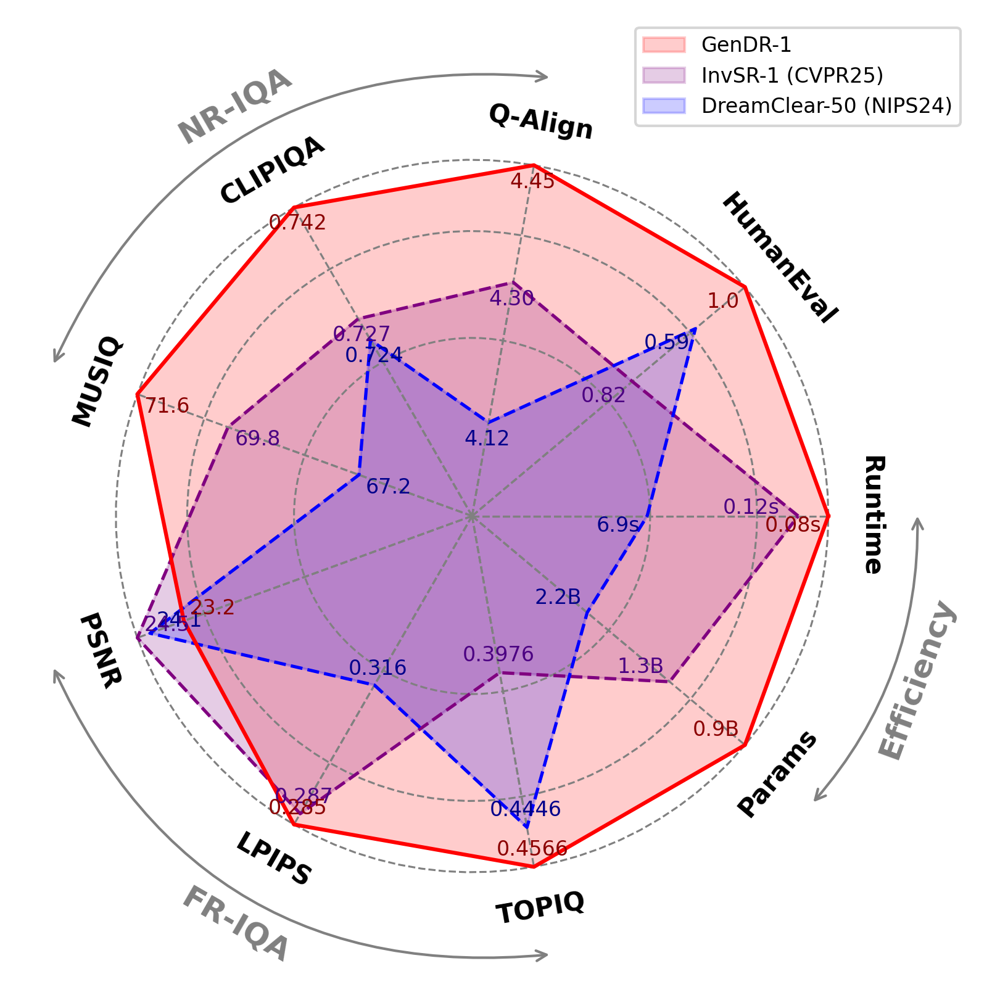

## <div align="center"> GenDR⚡: Lightning Generative Detail Restorator </div>

<div align="center"> 

[Yan Wang](https://scholar.google.com/citations?user=SXIehvoAAAAJ&hl=en), Shijie Zhao<sup>†</sup>, Kai Chen, Kexin Zhang, [Junlin Li](https://scholar.google.com/citations?user=daHqpg8AAAAJ&hl=en&oi=ao), [Li Zhang](https://scholar.google.com/citations?hl=en&user=8G5-2OMAAAAJ) 
</div>

<p align="center"> ByteDance
  
<p align="center">
<a href="https://icandle.github.io/gendr_page/">
    </a>
<a href="https://arxiv.org/abs/2503.06790" alt="arXiv">
    </a>
<a href="https://drive.google.com/file/d/18FW1SuoayABoes8l9ntKuk-xWi5b89Ye/view?usp=sharing">
    </a>

---

<p align="center">

</p align="center">

**Overview:** This work presents a ***one-step*** diffusion model for generative detail restoration, **GenDR**⚡, distilled from a tailored diffusion model with ***larger latent space***, to eliminate the dilemma arised by misalignment between T2I and SR tasks. 1) ***SD2.1-VAE16***: To expand a high-dimensional latent space without enlarging model size, we train a new SD2.1-VAE16 (0.9B) via representation alignment. 2) ***CiD/CiDA***: We propose consistent score identity distillation (CiD) incorporating SR task-specific loss into score distillation to leverage more SR priors and align the training target. Furthermore, we extend CiD with adversarial learning and representation alignment (CiDA) to enhance perceptual quality and accelerate training.  

[](https://imgsli.com/MzU4NDEx)


<details>
<summary>More visual comparison from RealDeg (click me)</summary>
<p align="left">

#### Social Media
  
[](https://imgsli.com/MzU4Mzk4)
[](https://imgsli.com/MzU4NDAy)
[](https://imgsli.com/MzU4NDA4)
[](https://imgsli.com/MzU4NDMz)


#### Classic Film

[](https://imgsli.com/MzU4NDE2)
[](https://imgsli.com/MzU4NDE4)
[](https://imgsli.com/MzU4NDMx)
[](https://imgsli.com/MzU4NDM2)

#### Old Photo

[](https://imgsli.com/MzU4NDMw)
[](https://imgsli.com/MzU4NDM4)
[](https://imgsli.com/MzU4NDQz)
[](https://imgsli.com/MzU4NDQx)
[^_^]: # [](https://imgsli.com/MzU4NDQ2)

</p>
</details>


<details>
<summary>More visual comparison from RealLR200 (click me)</summary>
<p align="left">

</p>
</details>

The repo is still under construction.

🔥 Update
---
- [2025.03] Repo and project created. The open-source process is in the audit stage and depends on the company policy. If all goes well, the code and weights will be released in the next two months.

💖 Acknowledgments
---
We would thank [Ostris](https://huggingface.co/ostris/vae-kl-f8-d16), [RealESRGAN](https://github.com/xinntao/Real-ESRGAN/tree/master/realesrgan), [OSEDiff](https://github.com/cswry/OSEDiff/blob/main/osediff.py), [SiD](https://github.com/mingyuanzhou/SiD), etal for their enlightening work!

🎓 Citation
---
```
@article{wang2025gendr,
  title={GenDR: Lightning Generative Detail Restorator},
  author={Wang, Yan and Zhao, Shijie and Chen, Kai and Zhang, Kexin and Li, Junlin and Zhang, Li},
  journal={arXiv preprint arXiv:2503.06790},
  year={2025}
```
